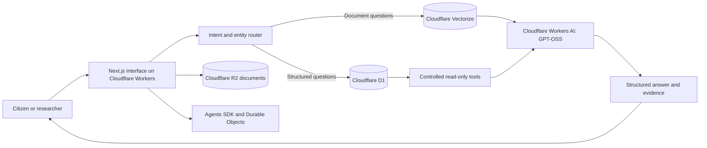

# GANI Copilot

### Turning Public Records into Public Understanding

[](https://gani-copilot.profshehu94.workers.dev)
[](https://developers.cloudflare.com/workers-ai/)
[](LICENSE)

GANI Copilot is an evidence-backed civic intelligence platform that helps people find, understand, verify, and act on Niger State public-budget information. Instead of ending at an AI answer, GANI lets a citizen move from a question to the underlying public record and clearly separates official evidence, AI interpretation, and community observations.

> Built as an original proof of concept for the Andela × Open Society Foundations virtual hackathon, in the **Transparency & Accountability** track.

## Try the working MVP

**Live application:** [gani-copilot.profshehu94.workers.dev](https://gani-copilot.profshehu94.workers.dev)

### Three-minute judging journey

1. Open [unified search](https://gani-copilot.profshehu94.workers.dev/search?q=Bida%20hospital) and search for **Bida hospital**.
2. Open the matching project to inspect its approved allocation, responsible MDA, location, and source record.
3. Open the linked budget document and inspect the original public record.
4. Ask GANI a budget question and review the attached sources and evidence classification.
5. On a project page, answer **“Have you seen this project in your community?”** Community observations remain separate from official facts and are hidden until approved.
6. Open the [future implementation page](https://gani-copilot.profshehu94.workers.dev/future) to see the path from Niger State proof of concept to broader Nigerian and African use.

## The civic problem

Government budgets may be public without being practically usable. Long PDFs, technical classifications, inconsistent terminology, weak search, and unclear provenance make it difficult for citizens, journalists, civil-society groups, and community leaders to answer simple questions:

- What was approved for my community?
- Which ministry owns this project?
- How does one sector or location compare with another?
- Where in the official document did this figure come from?
- Is a completion claim official, or only a community observation?

GANI addresses that gap with the interaction model **Ask → Understand → Verify → Explore → Act**.

## What is implemented

| Capability | How it works |
| --- | --- |
| Unified search | Searches projects, documents, MDAs, sectors, and locations without requiring AI for known records. |
| Budget exploration | Covers nine document-backed Niger State approved annual budgets, 2018–2026. |
| Project intelligence | Shows approved amounts, location, MDA, sector, source page, and source document where indexed. |
| Natural-language analysis | Routes questions to controlled, read-only tools and performs authoritative arithmetic in application code. |
| Document-scoped RAG | Vector retrieval is filtered by `document_id`; unrelated documents cannot silently enter the answer. |
| Evidence viewer | Presents source title, authority, year, page, excerpt, link, and evidence-quality classification. |
| Conversational context | Cloudflare Agents SDK and Durable Objects preserve filters for follow-up questions. |
| Community observations | Accepts anonymous, moderated observations that never overwrite official project facts. |
| Administration | Supports document ingestion, project import, directories, moderation, re-indexing, and operational logs. |

Document Q&A requires its stored passages to be indexed into Vectorize by an administrator. When no searchable passage exists, GANI returns an explicit unavailable-evidence response rather than inventing an answer.

## Trust and safety by design

- **Official public record** — data linked to an indexed government source.
- **AI interpretation** — a plain-language explanation constrained to approved tools and retrieved passages.
- **Community observation** — a moderated citizen report, never presented as an official status.
- Financial totals, rankings, percentages, and comparisons are calculated programmatically—not guessed by the language model.
- Public community counts include approved reports only.
- An approved allocation is not described as proof of fund release, construction, or completion.
- Missing or conflicting evidence is surfaced as a limitation.

Read [Data and evidence](docs/DATA_AND_EVIDENCE.md) and [Security](SECURITY.md) for the detailed boundaries.

## Architecture



| Layer | Technology |
| --- | --- |
| Web application | Next.js 16, React 19, TypeScript |
| Edge runtime | Cloudflare Workers through vinext |
| Structured records | Cloudflare D1 |
| Original documents | Cloudflare R2 and original publisher URLs |
| Semantic retrieval | Cloudflare Vectorize |
| AI inference | Cloudflare Workers AI using `@cf/openai/gpt-oss-20b` |
| Conversation state | Cloudflare Agents SDK + Durable Objects |
| Protection | Rate limiting, moderation, honeypot/timing checks; Turnstile is planned/configurable |

See [Architecture](docs/ARCHITECTURE.md) for request flows and trust boundaries.

## Run locally

Requirements: Node.js 20.9 or newer and a Cloudflare account for binding-backed features.

```bash
npm install
cp .env.example .dev.vars
npm run dev
```

Open `http://localhost:3000`. The public UI can run locally, while D1, R2, Vectorize, Workers AI, and Durable Object features require configured Cloudflare bindings or appropriate local equivalents.

### Environment values

```dotenv
ADMIN_SESSION_SECRET=replace-with-a-long-random-secret
ADMIN_PASSWORD=replace-with-a-strong-password
```

Never commit `.dev.vars`, `.env`, passwords, API tokens, or production data exports.

## Test and deploy

```bash
node --test tests/*.test.mjs
npm run typecheck
npm run build:vinext
npm run deploy:vinext
```

`wrangler.jsonc` defines the D1, R2, Vectorize, Workers AI, and Durable Object bindings. Create your own resources and replace resource identifiers before deploying a fork. Store secrets with Wrangler rather than in source control.

Official PDFs are deliberately not committed to Git because they would add more than 120 MB and are not relicensed by this project. The deployed application serves controlled copies from its document storage and retains original publisher provenance. A new deployment should ingest the records from their documented sources into its own R2 bucket.

## Repository guide

```text
app/          Next.js pages and API routes
components/   Public, evidence, search, chat, and admin interfaces
lib/          Repositories, routing, RAG, tools, validation, and telemetry
migrations/   D1 schema and source-backed seed data
worker/       Cloudflare Worker and Durable Object entry points
tests/        Retrieval, search, evidence, and moderation-boundary tests
docs/         Architecture, data methodology, judging guide, and roadmap
```

## Known proof-of-concept limitations

- Coverage is currently Niger State-focused and is not a complete or independently audited register of spending or delivery.
- The 2026 Citizens Budget has stored passages but requires an authenticated Vectorize indexing run before document Q&A is demonstrable.
- The separate detailed-estimates record currently has no stored passages for semantic retrieval.
- Turnstile and the fuller operational abuse-prevention plan are not yet enabled in the public deployment.
- Community observations depend on administrator review and do not verify physical delivery by themselves.
- Some historic source totals are rounded exactly as published in the source documents.

## From Niger State to Nigeria and Africa

The next phases focus on reusable public-record ingestion, multilingual and low-bandwidth access, stronger verification partnerships, configurable government jurisdictions, and community-centred deployment. The approach is designed to adapt to Nigerian states first, then to African jurisdictions with different budget structures and civic languages—without collapsing local context into one generic data model.

Read the [Nigeria and Africa roadmap](docs/ROADMAP.md).

## Originality, responsible reuse, and attribution

The product concept and application were created for this hackathon. AI development tools supported implementation, debugging, and documentation; they did not originate the core capstone idea. Contributions are welcome under [CONTRIBUTING.md](CONTRIBUTING.md).

The MIT license applies to the software code in this repository. Government PDFs and other third-party public records remain subject to their original publishers’ terms and are included for traceability and civic verification, not relicensed by this project.

## License

Software code is released under the [MIT License](LICENSE).
